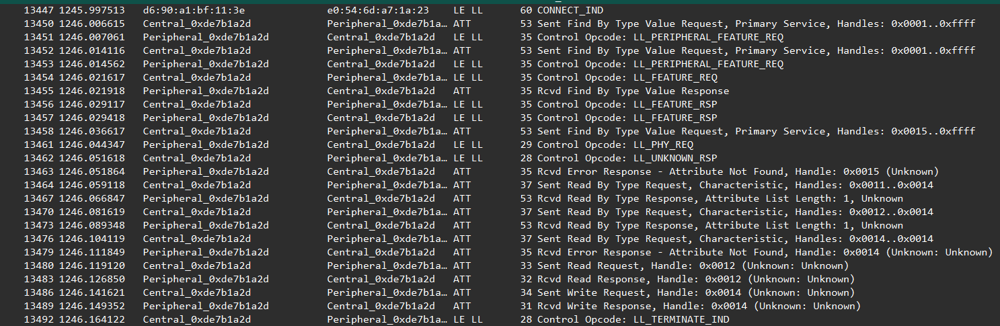

# BlueJoule GATT-RW Benchmark

Minimal Zephyr applications for an initial BlueJoule BLE connection benchmark.

This repository contains two Zephyr applications:

```text
central/
    Zephyr BLE central benchmark driver

peripheral/
    Zephyr BLE peripheral exposing the benchmark GATT profile
```

## Tested hardware

Current tested configuration:

```text
central:    Nordic nRF52 DK
peripheral: Nordic nRF54L15 DK
```

The code is expected to be portable to other Zephyr-supported BLE boards, but those are the boards used so far.

## Benchmark profile

The peripheral advertises and exposes a custom BlueJoule GATT-RW service.

```text
Service UUID:
    3f7a0001-7d4a-4b2d-9f2c-5a1d6e8c0001

Read Characteristic UUID:
    3f7a0002-7d4a-4b2d-9f2c-5a1d6e8c0001

Write Characteristic UUID:
    3f7a0003-7d4a-4b2d-9f2c-5a1d6e8c0001
```

The service contains two characteristics:

```text
BJ Read Characteristic
    readable
    current test value: 0x37

BJ Write Characteristic
    writable
    benchmark central writes: 0x42
```

## Benchmark sequence

The central performs a fixed BLE/GATT transaction:

```text
1. Scan for the advertised BlueJoule service UUID
2. Connect to the peripheral
3. Discover the BlueJoule primary service by UUID
4. Discover characteristics within that service range
5. Read the BJ Read characteristic
6. Write the BJ Write characteristic
7. Disconnect cleanly
```

The benchmark intentionally uses normal BLE discovery rather than fixed handles on the central side. The peripheral may use fixed/static handles internally, but the central discovers the service and characteristics by UUID.

## Connection parameters

The central currently requests the minimum BLE connection interval:

```text
interval min: 6    // 7.5 ms
interval max: 6    // 7.5 ms
latency:      0
timeout:      400  // 4 s
```

This makes the central drive the transaction aggressively. In current testing, the transaction completed in roughly 150 ms from `CONNECT_IND` to `LL_TERMINATE_IND`.


## Example sniffer trace

The following Nordic Sniffer / Wireshark capture shows the expected benchmark exchange. Empty LL data PDUs are suppressed in this view; normally one or two empty PDUs may appear between ATT request/response pairs.



Visible sequence:

```text
CONNECT_IND
Find By Type Value Request: primary service UUID
Find By Type Value Response
Find By Type Value Request: continue service search
Error Response: Attribute Not Found
Read By Type Request: characteristics in service range
Read By Type Response: read characteristic
Read By Type Request: next characteristic range
Read By Type Response: write characteristic
Read By Type Request: end of range
Error Response: Attribute Not Found
Read Request / Read Response
Write Request / Write Response
LL_TERMINATE_IND
```

## Building

From the repository root, build and flash the central:

```sh
west build -b nrf52dk/nrf52832 -d build-central central --pristine
west flash -d build-central
```

Build and flash the peripheral:

```sh
west build -b nrf54l15dk/nrf54l15/cpuapp -d build-peripheral peripheral --pristine
west flash -d build-peripheral
```

Adjust board names as needed for local hardware.

## Repository layout

```text
bluejoule-gatt-rw/
    README.md
    central/
        CMakeLists.txt
        prj.conf
        src/
            main.c
    peripheral/
        CMakeLists.txt
        prj.conf
        src/
            main.c
```

Build directories are intentionally not tracked.
