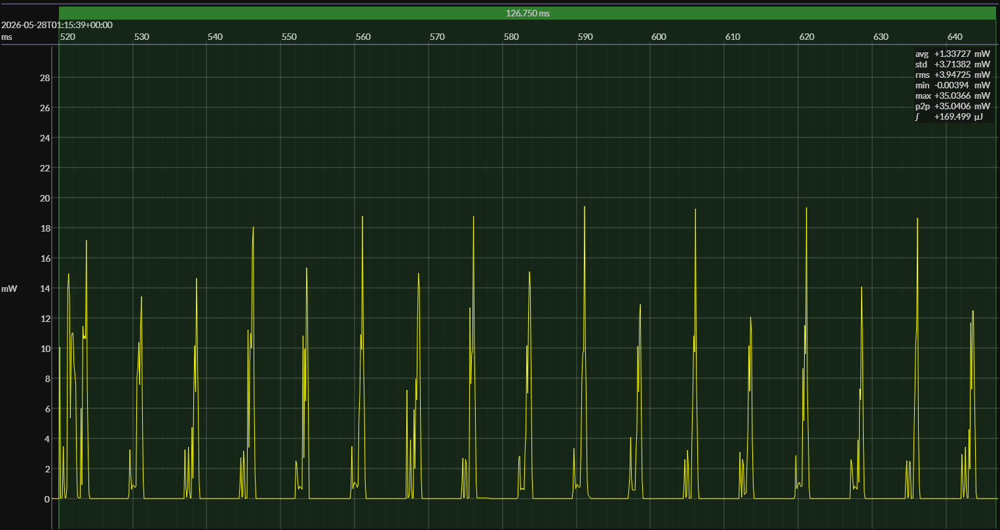

<h1 align="center">Nordic nRF54L15 · Zephyr OS · 3V0</h1>

<!-- @emscope-pack:start -->

<!-- *** AUTOMATICALLY GENERATED CONTENT – DO NOT EDIT *** -->  

captured on 2026-05-27 @ 22:32:36 generated on 2026-05-28 @ 02:07:59

## HW/SW Configuration

## EM&bull;Scope results · PPK2

### 🟠&ensp;sleep

| supply voltage | &emsp;current (avg)&emsp; | &emsp;current (std)&emsp; | &emsp;average power&emsp;
|:---:|:---:|:---:|:---:|
| 3.0 V |  1.1 µA |  0.7 µA |  3.3 µW |

### 🟠&ensp;1&thinsp;s event period

| &emsp;&emsp;event energy (avg)&emsp;&emsp; | &emsp;&emsp;energy per period&emsp;&emsp; | &emsp;&emsp;energy per day&emsp;&emsp; | &emsp;&emsp;&emsp;**EM&bull;eralds**&emsp;&emsp;&emsp;
|:---:|:---:|:---:|:---:|
| 168.8 µJ | 172.0 µJ | 14.9 J | 5.38 |

### 🟠&ensp;10&thinsp;s event period

| &emsp;&emsp;event energy (avg)&emsp;&emsp; | &emsp;&emsp;energy per period&emsp;&emsp; | &emsp;&emsp;energy per day&emsp;&emsp; | &emsp;&emsp;&emsp;**EM&bull;eralds**&emsp;&emsp;&emsp;
|:---:|:---:|:---:|:---:|
| 168.8 µJ | 201.3 µJ |  1.7 J | 46.00 |

## Typical Event

## Notes

<!-- @emscope-pack:end -->
