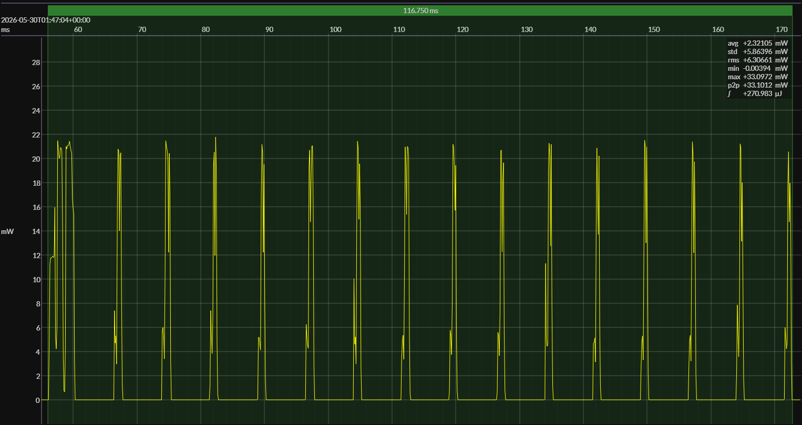

<h1 align="center">Nordic nRF52832 · EM&bull;Script SDK · 3V0</h1>

<!-- @emscope-pack:start -->

<!-- *** AUTOMATICALLY GENERATED CONTENT – DO NOT EDIT *** -->  

captured on 2026-05-30 @ 01:44:52 generated on 2026-05-30 @ 01:47:12

## HW/SW Configuration

## EM&bull;Scope results · PPK2

### 🟠&ensp;sleep

| supply voltage | &emsp;current (avg)&emsp; | &emsp;current (std)&emsp; | &emsp;average power&emsp;
|:---:|:---:|:---:|:---:|
| 3.0 V |  1.1 µA |  2.2 µA |  3.4 µW |

### 🟠&ensp;1&thinsp;s event period

| &emsp;&emsp;event energy (avg)&emsp;&emsp; | &emsp;&emsp;energy per period&emsp;&emsp; | &emsp;&emsp;energy per day&emsp;&emsp; | &emsp;&emsp;&emsp;**EM&bull;eralds**&emsp;&emsp;&emsp;
|:---:|:---:|:---:|:---:|
| 270.6 µJ | 274.0 µJ | 23.7 J | 3.38 |

### 🟠&ensp;10&thinsp;s event period

| &emsp;&emsp;event energy (avg)&emsp;&emsp; | &emsp;&emsp;energy per period&emsp;&emsp; | &emsp;&emsp;energy per day&emsp;&emsp; | &emsp;&emsp;&emsp;**EM&bull;eralds**&emsp;&emsp;&emsp;
|:---:|:---:|:---:|:---:|
| 270.6 µJ | 304.2 µJ |  2.6 J | 30.44 |

## Typical Event

## Notes

<!-- @emscope-pack:end -->
