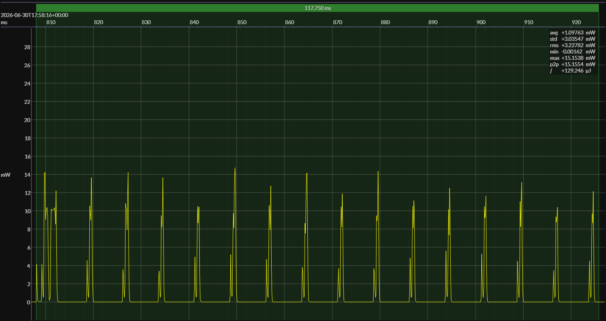

<h1 align="center">Nordic nRF54L15 M33 · EM&bull;Script SDK · 3V0</h1>

<!-- @emscope-pack:start -->

<!-- *** AUTOMATICALLY GENERATED CONTENT – DO NOT EDIT *** -->

captured on 2026-06-30 @ 17:31:16 generated on 2026-06-30 @ 17:58:33

## HW/SW Configuration

## EM&bull;Scope results · PPK2

### 🟠&ensp;sleep

| supply voltage | &emsp;current (avg)&emsp; | &emsp;current (std)&emsp; | &emsp;average power&emsp; |
| :------------: | :-----------------------: | :-----------------------: | :-----------------------: |
|     3.0 V      |          0.8 µA           |          0.1 µA           |          2.3 µW           |

### 🟠&ensp;1&thinsp;s event period

| &emsp;&emsp;event energy (avg)&emsp;&emsp; | &emsp;&emsp;energy per period&emsp;&emsp; | &emsp;&emsp;energy per day&emsp;&emsp; | &emsp;&emsp;&emsp;**EM&bull;eralds**&emsp;&emsp;&emsp; |
| :----------------------------------------: | :---------------------------------------: | :------------------------------------: | :----------------------------------------------------: |
|                  129.6 µJ                  |                 131.9 µJ                  |                 11.4 J                 |                          7.02                          |

### 🟠&ensp;10&thinsp;s event period

| &emsp;&emsp;event energy (avg)&emsp;&emsp; | &emsp;&emsp;energy per period&emsp;&emsp; | &emsp;&emsp;energy per day&emsp;&emsp; | &emsp;&emsp;&emsp;**EM&bull;eralds**&emsp;&emsp;&emsp; |
| :----------------------------------------: | :---------------------------------------: | :------------------------------------: | :----------------------------------------------------: |
|                  129.6 µJ                  |                 152.2 µJ                  |                 1.3 J                  |                         60.82                          |

## Typical Event

## Notes

<!-- @emscope-pack:end -->
