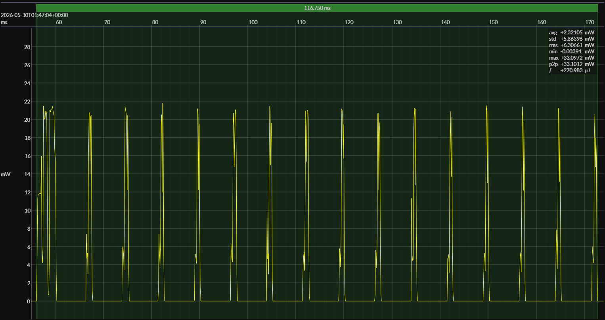

<!-- GENERATED FILE — DO NOT EDIT -->

<h1 align="center">Nordic nRF52 DK · EM•Script</h1>
<h3 align="center">Bench supply · 3V0</h3>

captured on 2026-05-30 @ 01:44:52 generated on 2026-07-30 @ 22:17:21

## Platform

- MCU: Nordic nRF52832
- CPU: 64 MHz Arm Cortex-M4
- Flash: 512 KB
- SRAM: 64 KB
- Board: Nordic nRF52 Development Kit
- Software environment: EM•Script
- EM•Script SDK: 26.2.0

### References

- [Nordic nRF52832](https://www.nordicsemi.com/Products/nRF52832)
- [Nordic nRF52 DK](https://www.nordicsemi.com/Products/Development-hardware/nRF52-DK)
- [Board pinout](https://github.com/em-foundation/emscope/blob/docs-stable/docs/boards/nrf-52-dk.png)
- [EM•Script project](https://github.com/em-foundation/emporium)

## EM&bull;Scope results · PPK2

### 🟠&ensp;sleep

| supply voltage | &emsp;current (avg)&emsp; | &emsp;current (std)&emsp; | &emsp;average power&emsp;
|:---:|:---:|:---:|:---:|
| 3.0 V |  1.1 µA |  2.2 µA |  3.4 µW |

### 🟠&ensp;1&thinsp;s event period

| &emsp;&emsp;event energy (avg)&emsp;&emsp; | &emsp;&emsp;energy per period&emsp;&emsp; | &emsp;&emsp;energy per day&emsp;&emsp; | &emsp;&emsp;&emsp;**EM&bull;eralds**&emsp;&emsp;&emsp;
|:---:|:---:|:---:|:---:|
| 270.6 µJ | 274.0 µJ | 23.7 J | 3.38 |

### 🟠&ensp;10&thinsp;s event period

| &emsp;&emsp;event energy (avg)&emsp;&emsp; | &emsp;&emsp;energy per period&emsp;&emsp; | &emsp;&emsp;energy per day&emsp;&emsp; | &emsp;&emsp;&emsp;**EM&bull;eralds**&emsp;&emsp;&emsp;
|:---:|:---:|:---:|:---:|
| 270.6 µJ | 304.2 µJ |  2.6 J | 30.44 |

## Typical Event

