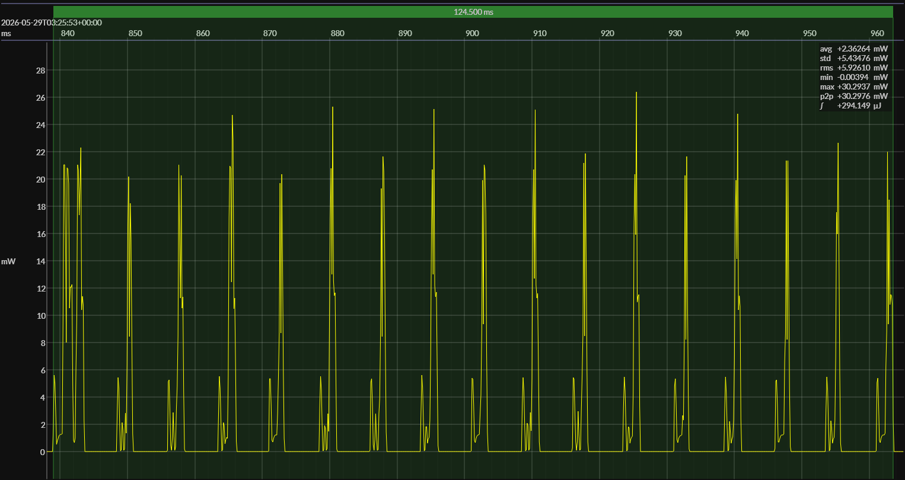

<!-- GENERATED FILE — DO NOT EDIT -->

<h1 align="center">Nordic nRF52 DK · Zephyr</h1>
<h3 align="center">Bench supply · 3V0</h3>

captured on 2026-05-29 @ 03:24:08 generated on 2026-07-30 @ 22:17:21

## Platform

- MCU: Nordic nRF52832
- CPU: 64 MHz Arm Cortex-M4
- Flash: 512 KB
- SRAM: 64 KB
- Board: Nordic nRF52 Development Kit
- Software stack: Zephyr
- nRF Connect SDK: 3.0.2
- Toolchain: nRF Connect SDK Toolchain 3.0.2

### References

- [Nordic nRF52832](https://www.nordicsemi.com/Products/nRF52832)
- [Nordic nRF52 DK](https://www.nordicsemi.com/Products/Development-hardware/nRF52-DK)
- [Board pinout](https://github.com/em-foundation/emscope/blob/docs-stable/docs/boards/nrf-52-dk.png)
- [nRF Connect SDK](https://www.nordicsemi.com/Products/Development-software/nRF-Connect-SDK)

## EM&bull;Scope results · PPK2

### 🟠&ensp;sleep

| supply voltage | &emsp;current (avg)&emsp; | &emsp;current (std)&emsp; | &emsp;average power&emsp;
|:---:|:---:|:---:|:---:|
| 3.0 V |  1.2 µA |  2.6 µA |  3.6 µW |

### 🟠&ensp;1&thinsp;s event period

| &emsp;&emsp;event energy (avg)&emsp;&emsp; | &emsp;&emsp;energy per period&emsp;&emsp; | &emsp;&emsp;energy per day&emsp;&emsp; | &emsp;&emsp;&emsp;**EM&bull;eralds**&emsp;&emsp;&emsp;
|:---:|:---:|:---:|:---:|
| 293.0 µJ | 296.6 µJ | 25.6 J | 3.12 |

### 🟠&ensp;10&thinsp;s event period

| &emsp;&emsp;event energy (avg)&emsp;&emsp; | &emsp;&emsp;energy per period&emsp;&emsp; | &emsp;&emsp;energy per day&emsp;&emsp; | &emsp;&emsp;&emsp;**EM&bull;eralds**&emsp;&emsp;&emsp;
|:---:|:---:|:---:|:---:|
| 293.0 µJ | 328.8 µJ |  2.8 J | 28.16 |

## Typical Event

