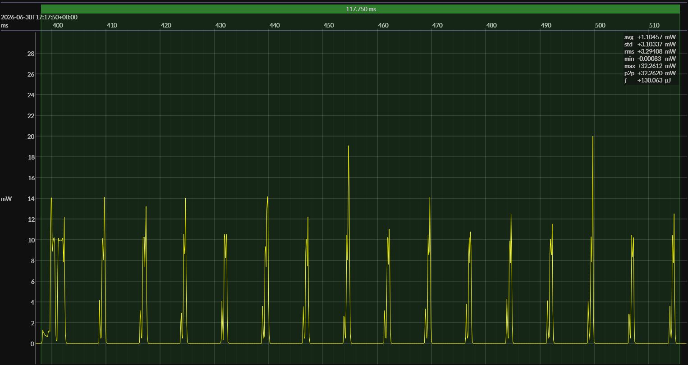

<!-- GENERATED FILE — DO NOT EDIT -->

<h1 align="center">Nordic nRF54L15 DK · FLPR · EM•Script</h1>
<h3 align="center">Bench supply · 3V0</h3>

captured on 2026-06-30 @ 17:09:08 generated on 2026-08-13 @ 14:58:49

## Activity

- Activity: Bluetooth Low Energy peripheral connection and GATT transaction
- Role: BLE peripheral
- PHY: LE 1M
- TX power: 0 dBm
- Advertising: connectable advertising used only to establish the connection
- Advertising payload: includes the BlueJoule-GATT service UUID in the primary advertising packet
- Scored window: begins with the connection transaction and excludes preceding advertising energy
- Transaction: connect, link-layer setup, targeted service discovery, targeted characteristic discovery, write `Command`, read `Status`, disconnect, return toward idle or sleep
- Discovery: targeted to the benchmark service and characteristics; full generic GATT enumeration is not required
- Service UUID: `0000b100-0000-1000-8000-00805f9b34fb`
- Status characteristic UUID: `0000b101-0000-1000-8000-00805f9b34fb`
- Status characteristic operation: read
- Command characteristic UUID: `0000b102-0000-1000-8000-00805f9b34fb`
- Command characteristic operation: write
- Handle discovery: benchmark central knows the UUIDs but discovers handles at runtime
- Primary measured quantity: energy per completed BlueJoule-GATT transaction
- Conformance basis: observable behavior, not a canonical source implementation

## Platform

- MCU: Nordic nRF54L15
- CPU: Arm Cortex-M33, 128 MHz
- Flash: 1.5 MB
- SRAM: 256 KB
- Board: Nordic nRF54L15 DK
- EM•Script SDK: 26.3
- Board: `nordic.nrf54.flpr://NRF54L15_DK`
- Setup: `nordic.nrf54.flpr://default`
- Executing core: nRF54L15 FLPR
- Architecture: RISC-V

### References

- [nRF54L15 product page](https://www.nordicsemi.com/Products/nRF54L15)
- [nRF54L15 DK](https://www.nordicsemi.com/Products/Development-hardware/nRF54L15-DK)

## Power Source

- Power source: regulated bench supply
- State of charge: not applicable
- Battery model: none

## EM&bull;Scope results · PPK2

### 🟠&ensp;sleep

| supply voltage | &emsp;current (avg)&emsp; | &emsp;current (std)&emsp; | &emsp;average power&emsp;
|:---:|:---:|:---:|:---:|
| 3.0 V |  0.8 µA |  0.1 µA |  2.3 µW |

### 🟠&ensp;1&thinsp;s event period

| &emsp;&emsp;event energy (avg)&emsp;&emsp; | &emsp;&emsp;event energy (std)&emsp;&emsp; | &emsp;&emsp;energy per period&emsp;&emsp; | &emsp;&emsp;energy per day&emsp;&emsp; | &emsp;&emsp;&emsp;**EM&bull;eralds**&emsp;&emsp;&emsp;
|:---:|:---:|:---:|:---:|:---:|
| 129.7 µJ |  0.4 µJ | 131.7 µJ | 11.4 J | 7.03 |

### 🟠&ensp;10&thinsp;s event period

| &emsp;&emsp;event energy (avg)&emsp;&emsp; | &emsp;&emsp;event energy (std)&emsp;&emsp; | &emsp;&emsp;energy per period&emsp;&emsp; | &emsp;&emsp;energy per day&emsp;&emsp; | &emsp;&emsp;&emsp;**EM&bull;eralds**&emsp;&emsp;&emsp;
|:---:|:---:|:---:|:---:|:---:|
| 129.7 µJ |  0.4 µJ | 152.0 µJ |  1.3 J | 60.94 |

## Typical Event

