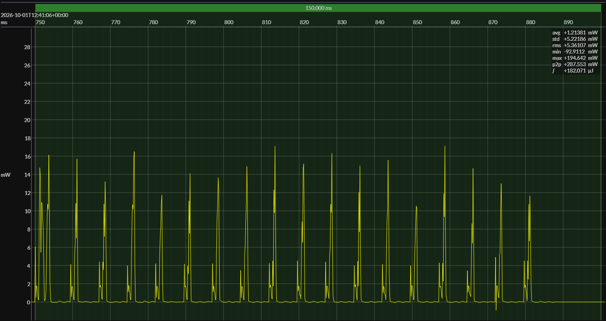

<!-- GENERATED FILE — DO NOT EDIT -->

<h1 align="center">Nordic nRF54L15 DK · Zephyr · NCS 3.0.2</h1>
<h3 align="center">Bench supply · 3V0</h3>

captured on 2026-10-01 @ 12:37:39 generated on 2026-10-01 @ 12:41:45

## Activity

- Activity: Bluetooth Low Energy peripheral connection and GATT transaction
- Role: BLE peripheral
- PHY: LE 1M
- TX power: 0 dBm
- Advertising: connectable advertising used only to establish the connection
- Advertising payload: includes the BlueJoule-GATT service UUID in the primary advertising packet
- Scored window: begins with the connection transaction and excludes preceding advertising energy
- Transaction: connect, link-layer setup, targeted service discovery, targeted characteristic discovery, write `Command`, read `Status`, disconnect, return toward idle or sleep
- Discovery: targeted to the benchmark service and characteristics; full generic GATT enumeration is not required
- Service UUID: `0000b100-0000-1000-8000-00805f9b34fb`
- Status characteristic UUID: `0000b101-0000-1000-8000-00805f9b34fb`
- Status characteristic operation: read
- Command characteristic UUID: `0000b102-0000-1000-8000-00805f9b34fb`
- Command characteristic operation: write
- Handle discovery: benchmark central knows the UUIDs but discovers handles at runtime
- Primary measured quantity: energy per completed BlueJoule-GATT transaction
- Conformance basis: observable behavior, not a canonical source implementation

## Platform

- MCU: Nordic nRF54L15
- CPU: Arm Cortex-M33, 128 MHz
- Flash: 1.5 MB
- SRAM: 256 KB
- Board: Nordic nRF54L15 DK
- Software stack: Zephyr
- nRF Connect SDK: 3.0.2
- Toolchain: nRF Connect SDK Toolchain 3.0.2
- Retained SRAM: default configuration
- LF clock source: ...
- DC-DC converter: enabled
- Compiler optimization: ...

### References

- [nRF54L15 product page](https://www.nordicsemi.com/Products/nRF54L15)
- [nRF54L15 DK](https://www.nordicsemi.com/Products/Development-hardware/nRF54L15-DK)
- [nRF Connect SDK](https://www.nordicsemi.com/Products/Development-software/nRF-Connect-SDK)

## Power Source

- Power source: regulated bench supply
- State of charge: not applicable
- Battery model: none

## EM&bull;Scope results · JS220

### 🟠&ensp;measured voltage

| &emsp;average&emsp; | &emsp;minimum&emsp; | &emsp;maximum&emsp; | &emsp;standard deviation&emsp;
|:---:|:---:|:---:|:---:|
| 2.997 V | 2.935 V | 3.035 V | 0.001 V |

### 🟠&ensp;sleep

| supply voltage | &emsp;current (avg)&emsp; | &emsp;current (std)&emsp; | &emsp;average power&emsp;
|:---:|:---:|:---:|:---:|
| 3.0 V |  1.7 µA |  4.7 µA |  4.9 µW |

### 🟠&ensp;boundary / closure

| accounting window | sleep window | event duty | closure residual | floor residual |
|:---:|:---:|:---:|:---:|:---:|
| 9.719 s | 0.100 s | 15.433% | 0.002% | -0.7 µA |

### 🟠&ensp;1&thinsp;s score

| &emsp;&emsp;event energy (avg)&emsp;&emsp; | &emsp;&emsp;event energy (std)&emsp;&emsp; | &emsp;&emsp;energy per period&emsp;&emsp; | &emsp;&emsp;energy per day&emsp;&emsp; | &emsp;&emsp;&emsp;**EM&bull;eralds**&emsp;&emsp;&emsp;
|:---:|:---:|:---:|:---:|:---:|
| 174.9 µJ |  2.4 µJ | 179.1 µJ | 15.5 J | 5.17 |

### 🟠&ensp;10&thinsp;s projection

| &emsp;&emsp;event energy (avg)&emsp;&emsp; | &emsp;&emsp;event energy (std)&emsp;&emsp; | &emsp;&emsp;energy per period&emsp;&emsp; | &emsp;&emsp;energy per day&emsp;&emsp; | &emsp;&emsp;&emsp;**EM&bull;eralds**&emsp;&emsp;&emsp;
|:---:|:---:|:---:|:---:|:---:|
| 174.9 µJ |  2.4 µJ | 223.6 µJ |  1.9 J | 41.41 |

## Typical Event

