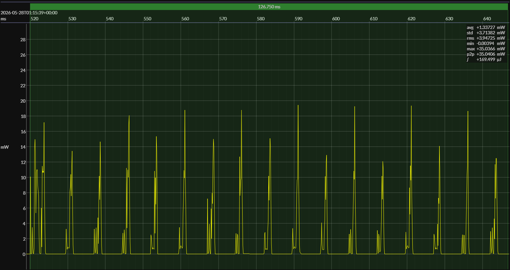

<!-- GENERATED FILE — DO NOT EDIT -->

<h1 align="center">Nordic nRF54L15 DK · Zephyr · NCS 3.0.2</h1>
<h3 align="center">Bench supply · 3V0</h3>

captured on 2026-05-27 @ 22:32:36 generated on 2026-07-30 @ 22:17:23

## Platform

- MCU: Nordic nRF54L15
- CPU: Arm Cortex-M33, 128 MHz
- Flash: 1.5 MB
- SRAM: 256 KB
- Board: Nordic nRF54L15 DK
- Software stack: Zephyr
- nRF Connect SDK: 3.0.2
- Toolchain: nRF Connect SDK Toolchain 3.0.2
- Retained SRAM: default configuration
- LF clock source: ...
- DC-DC converter: enabled
- Compiler optimization: ...

### References

- [nRF54L15 product page](https://www.nordicsemi.com/Products/nRF54L15)
- [nRF54L15 DK](https://www.nordicsemi.com/Products/Development-hardware/nRF54L15-DK)
- [nRF Connect SDK](https://www.nordicsemi.com/Products/Development-software/nRF-Connect-SDK)

## EM&bull;Scope results · PPK2

### 🟠&ensp;sleep

| supply voltage | &emsp;current (avg)&emsp; | &emsp;current (std)&emsp; | &emsp;average power&emsp;
|:---:|:---:|:---:|:---:|
| 3.0 V |  1.1 µA |  0.7 µA |  3.3 µW |

### 🟠&ensp;1&thinsp;s event period

| &emsp;&emsp;event energy (avg)&emsp;&emsp; | &emsp;&emsp;energy per period&emsp;&emsp; | &emsp;&emsp;energy per day&emsp;&emsp; | &emsp;&emsp;&emsp;**EM&bull;eralds**&emsp;&emsp;&emsp;
|:---:|:---:|:---:|:---:|
| 168.8 µJ | 172.0 µJ | 14.9 J | 5.38 |

### 🟠&ensp;10&thinsp;s event period

| &emsp;&emsp;event energy (avg)&emsp;&emsp; | &emsp;&emsp;energy per period&emsp;&emsp; | &emsp;&emsp;energy per day&emsp;&emsp; | &emsp;&emsp;&emsp;**EM&bull;eralds**&emsp;&emsp;&emsp;
|:---:|:---:|:---:|:---:|
| 168.8 µJ | 201.3 µJ |  1.7 J | 46.00 |

## Typical Event

