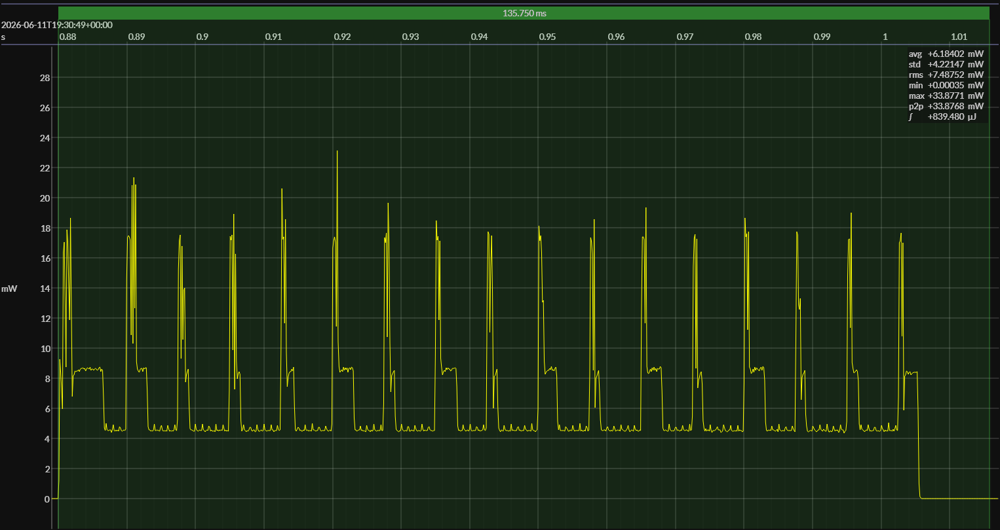

<!-- GENERATED FILE — DO NOT EDIT -->

<h1 align="center">Texas Instruments CC2340R5 LaunchPad · SimpleLink SDK</h1>
<h3 align="center">Bench supply · 3V0</h3>

captured on 2026-06-11 @ 19:29:30 generated on 2026-08-13 @ 14:58:56

## Activity

- Activity: Bluetooth Low Energy peripheral connection and GATT transaction
- Role: BLE peripheral
- PHY: LE 1M
- TX power: 0 dBm
- Advertising: connectable advertising used only to establish the connection
- Advertising payload: includes the BlueJoule-GATT service UUID in the primary advertising packet
- Scored window: begins with the connection transaction and excludes preceding advertising energy
- Transaction: connect, link-layer setup, targeted service discovery, targeted characteristic discovery, write `Command`, read `Status`, disconnect, return toward idle or sleep
- Discovery: targeted to the benchmark service and characteristics; full generic GATT enumeration is not required
- Service UUID: `0000b100-0000-1000-8000-00805f9b34fb`
- Status characteristic UUID: `0000b101-0000-1000-8000-00805f9b34fb`
- Status characteristic operation: read
- Command characteristic UUID: `0000b102-0000-1000-8000-00805f9b34fb`
- Command characteristic operation: write
- Handle discovery: benchmark central knows the UUIDs but discovers handles at runtime
- Primary measured quantity: energy per completed BlueJoule-GATT transaction
- Conformance basis: observable behavior, not a canonical source implementation

## Platform

- Board: Texas Instruments CC2340R5 LaunchPad
- MCU: Texas Instruments CC2340R5
- CPU: 48 MHz Arm Cortex-M0+
- Flash: 512 KB
- SRAM: 64 KB
- Development environment: Code Composer Studio IDE
- Code Composer Studio IDE: 12.4.0
- Compiler: TI Arm Clang 2.1.3
- SimpleLink SDK: 8.10.0

### References

- [LP-EM-CC2340R5 Development Kit](https://www.ti.com/tool/LP-EM-CC2340R5)
- [CC2340R5 SoC](https://www.ti.com/product/CC2340R5)
- [Code Composer Studio IDE](https://www.ti.com/tool/CCSTUDIO)
- [TI Arm Clang compiler](https://www.ti.com/tool/download/ARM-CGT-CLANG)
- [SimpleLink SDK](https://www.ti.com/tool/SIMPLELINK-LOWPOWER-SDK)

## Power Source

- Power source: regulated bench supply
- State of charge: not applicable
- Battery model: none

## EM&bull;Scope results · PPK2

### 🟠&ensp;sleep

| supply voltage | &emsp;current (avg)&emsp; | &emsp;current (std)&emsp; | &emsp;average power&emsp;
|:---:|:---:|:---:|:---:|
| 3.0 V |  0.2 µA |  0.1 µA | 614.6 nW |

### 🟠&ensp;1&thinsp;s event period

| &emsp;&emsp;event energy (avg)&emsp;&emsp; | &emsp;&emsp;event energy (std)&emsp;&emsp; | &emsp;&emsp;energy per period&emsp;&emsp; | &emsp;&emsp;energy per day&emsp;&emsp; | &emsp;&emsp;&emsp;**EM&bull;eralds**&emsp;&emsp;&emsp;
|:---:|:---:|:---:|:---:|:---:|
| 839.6 µJ |  1.2 µJ | 840.1 µJ | 72.6 J | 1.10 |

### 🟠&ensp;10&thinsp;s event period

| &emsp;&emsp;event energy (avg)&emsp;&emsp; | &emsp;&emsp;event energy (std)&emsp;&emsp; | &emsp;&emsp;energy per period&emsp;&emsp; | &emsp;&emsp;energy per day&emsp;&emsp; | &emsp;&emsp;&emsp;**EM&bull;eralds**&emsp;&emsp;&emsp;
|:---:|:---:|:---:|:---:|:---:|
| 839.6 µJ |  1.2 µJ | 845.7 µJ |  7.3 J | 10.95 |

## Typical Event

