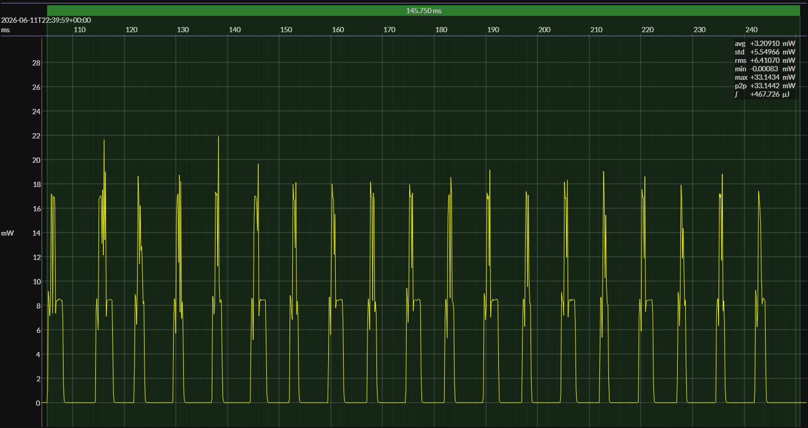

<!-- GENERATED FILE — DO NOT EDIT -->

<h1 align="center">Texas Instruments CC2340R5 LaunchPad · Zephyr</h1>
<h3 align="center">Bench supply · 3V0</h3>

captured on 2026-06-11 @ 22:36:41 generated on 2026-07-30 @ 22:37:04

## Platform

- Board: Texas Instruments CC2340R5 LaunchPad
- MCU: Texas Instruments CC2340R5
- CPU: 48 MHz Arm Cortex-M0+
- Flash: 512 KB
- SRAM: 64 KB
- Software stack: Zephyr
- Repository: Texas Instruments simplelink-zephyr
- Branch: v3.7.0-ti-9.14
- Tag: v3.7.0-ti-9.14.02_ea
- Commit: 8526f94c81d
- TI SimpleLink Zephyr release: v3.7.0-ti-9.14.02_ea

### References

- [LP-EM-CC2340R5 Development Kit](https://www.ti.com/tool/LP-EM-CC2340R5)
- [CC2340R5 SoC](https://www.ti.com/product/CC2340R5)
- [TI SimpleLink Zephyr](https://github.com/TexasInstruments/simplelink-zephyr/tree/v3.7.0-ti-9.14.02_ea)

## EM&bull;Scope results · PPK2

### 🟠&ensp;sleep

| supply voltage | &emsp;current (avg)&emsp; | &emsp;current (std)&emsp; | &emsp;average power&emsp;
|:---:|:---:|:---:|:---:|
| 3.0 V |  0.2 µA |  0.1 µA | 672.5 nW |

### 🟠&ensp;1&thinsp;s event period

| &emsp;&emsp;event energy (avg)&emsp;&emsp; | &emsp;&emsp;energy per period&emsp;&emsp; | &emsp;&emsp;energy per day&emsp;&emsp; | &emsp;&emsp;&emsp;**EM&bull;eralds**&emsp;&emsp;&emsp;
|:---:|:---:|:---:|:---:|
| 468.4 µJ | 469.1 µJ | 40.5 J | 1.97 |

### 🟠&ensp;10&thinsp;s event period

| &emsp;&emsp;event energy (avg)&emsp;&emsp; | &emsp;&emsp;energy per period&emsp;&emsp; | &emsp;&emsp;energy per day&emsp;&emsp; | &emsp;&emsp;&emsp;**EM&bull;eralds**&emsp;&emsp;&emsp;
|:---:|:---:|:---:|:---:|
| 468.4 µJ | 475.2 µJ |  4.1 J | 19.49 |

## Typical Event

