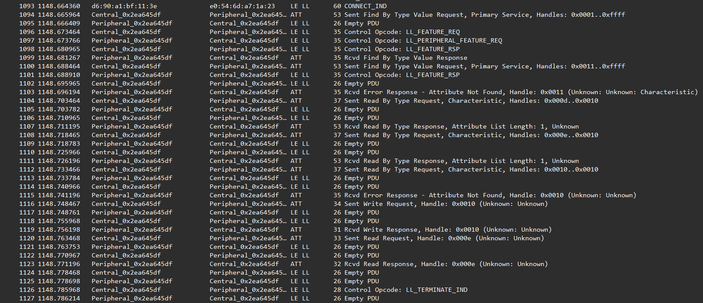
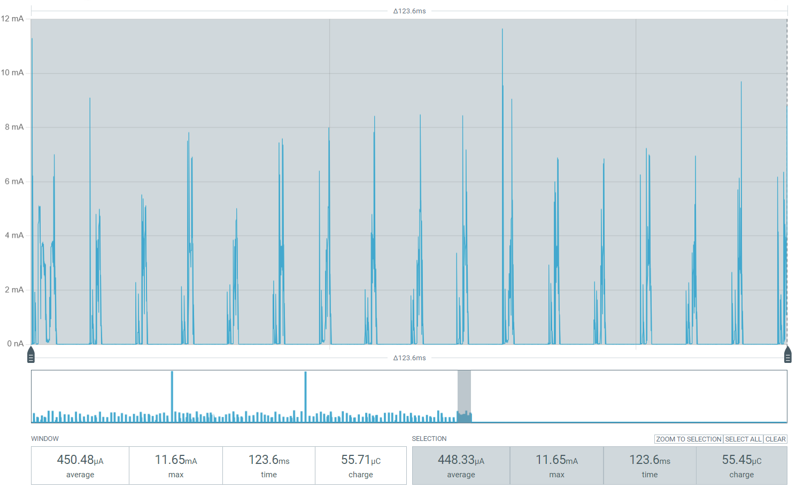

# Zephyr Reference Implementation

**Status:** Reference implementation milestone  
**Repository:** `bluejoule-gatt`  
**Benchmark definition:** [`01-bluejoule-gatt-definition.md`](01-bluejoule-gatt-definition.md)

## TLDR

- This report documents the first Zephyr implementation of BlueJoule-GATT.
- Zephyr is used for both the benchmark central and reference peripheral.
- The central runs on a Nordic nRF52 DK.
- The peripheral runs on a Nordic nRF54L15 DK.
- The peripheral build uses about **130 KB flash** and **25.6 KB RAM**.
- The packet trace shows a **122 ms** connection transaction over **17 connection events**.
- The measured connection charge is about **57 µC**.
- At 3.0 V, this corresponds to about **171 µJ**.

## 1. Purpose

This report documents a concrete Zephyr implementation of the BlueJoule-GATT benchmark.

The benchmark itself is defined separately in:

```text
reports/01-bluejoule-gatt-definition.md
```

This report records the Zephyr source layout, build flow, tested hardware, peripheral build size, packet trace, and measured connection energy.

## 2. Source Layout

```text
central/
    Zephyr BLE central benchmark driver

peripheral/
    Zephyr BLE peripheral reference implementation
```

The `central/` application drives the benchmark transaction.

The `peripheral/` application provides the Zephyr reference peripheral.

## 3. Tested Hardware

```text
central:    Nordic nRF52 DK
peripheral: Nordic nRF54L15 DK
```

## 4. Build Flow

Build and flash the central:

```sh
west build -b nrf52dk/nrf52832 -d build-central central --pristine
west flash -d build-central
```

Build and flash the peripheral:

```sh
west build -b nrf54l15dk/nrf54l15/cpuapp -d build-peripheral peripheral --pristine
west flash -d build-peripheral
```

Adjust board names as needed for local hardware.

## 5. Peripheral Build Size

Current Zephyr peripheral build size:

```text
FLASH: 130,040 bytes
RAM:    25,588 bytes
```

This is the current Zephyr reference baseline.

## 6. Packet Trace

The packet trace demonstrates that this Zephyr implementation completes the BlueJoule-GATT transaction defined in report 01.



Trace summary:

```text
connection duration: 122 ms
connection events:   17
```

## 7. Energy Measurement

The measured connection charge is about **57 µC**.

At 3.0 V:

```text
57 µC × 3.0 V = 171 µJ
```



This measurement covers the connection transaction only. Advertising before the connection is excluded.

## 8. Closing Note

This report records the current Zephyr reference baseline.

Further Zephyr tuning may reduce image size or energy.
