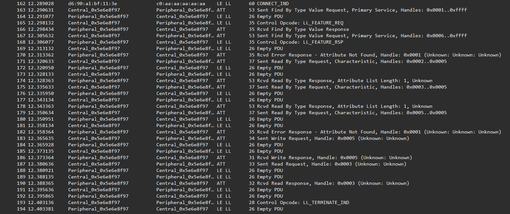
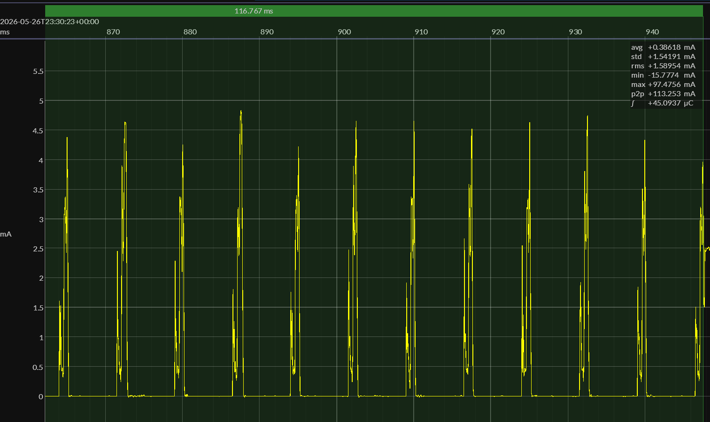
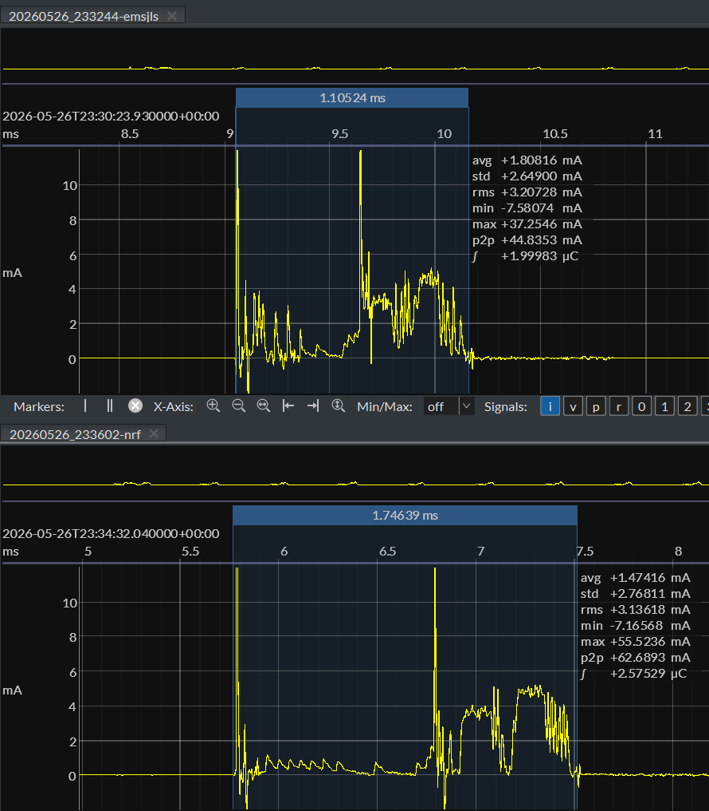

# EM•Script Candidate Implementation

**Status:** Candidate implementation milestone  
**Repository:** `bluejoule-gatt`  
**Benchmark definition:** [`01-bluejoule-gatt-definition.md`](01-bluejoule-gatt-definition.md)  
**Reference baseline:** [`02-zephyr-reference-implementation.md`](02-zephyr-reference-implementation.md)

## TLDR

- This report documents the current EM•Script candidate implementation of BlueJoule-GATT.
- The benchmark central is the Zephyr central documented in report 02.
- The candidate peripheral runs on a Nordic nRF54L15 DK.
- The EM•Script peripheral completes the same BlueJoule-GATT transaction as the Zephyr reference.
- The EM•Script build uses about **5 KB** of code.
- The packet trace shows a **116.67 ms** connection transaction over **16 connection events**.
- The measured connection charge is about **45.09 µC**.
- At 3.0 V, this corresponds to about **135.3 µJ**.
- The Zephyr reference measured about **171.0 µJ**.
- The EM•Script candidate is therefore about **21% lower energy** for this transaction.

## 1. Purpose

This report documents a concrete EM•Script candidate implementation of the BlueJoule-GATT benchmark.

The benchmark itself is defined separately in:

```text
reports/01-bluejoule-gatt-definition.md
```

The Zephyr reference implementation is documented in:

```text
reports/02-zephyr-reference-implementation.md
```

This report records the EM•Script candidate result: tested hardware, build size, packet trace, energy measurement, and the main technical reasons this implementation is smaller and lower-energy than the Zephyr reference.

## 2. Tested Hardware

```text
central:    Nordic nRF52 DK running the Zephyr benchmark central
peripheral: Nordic nRF54L15 DK running the EM•Script candidate peripheral
```

The central is the same Zephyr benchmark central used for the Zephyr reference run.

The peripheral is replaced with the EM•Script candidate implementation.

## 3. Build Size

Current EM•Script candidate build:

```text
text:  4,792 bytes
const:   292 bytes
data:     40 bytes
bss:     212 bytes
```

External shorthand:

```text
about 5 KB of code
```

For comparison, the Zephyr reference peripheral in report 02 uses:

```text
FLASH: 130,040 bytes
RAM:    25,588 bytes
```

The exact ratio is less important than the practical implication: the EM•Script candidate is small enough that code locality, instruction fetch behavior, dispatch overhead, and retained-state behavior become part of the energy result.

## 4. Packet Trace

The packet trace demonstrates that the EM•Script peripheral completes the BlueJoule-GATT transaction defined in report 01 when driven by the Zephyr benchmark central.



Trace summary:

```text
connection duration: 116.67 ms
connection events:   16
```

## 5. Energy Measurement

The measured connection charge is about **45.09 µC**.

At 3.0 V:

```text
45.0937 µC × 3.0 V = 135.281 µJ
```



This measurement covers the connection transaction only. Advertising before the connection is excluded.

## 6. Comparison With Zephyr Reference

Current same-hardware comparison:

```text
EM•Script candidate:   45.0937 µC × 3.0 V = 135.281 µJ
Zephyr reference:      56.9883 µC × 3.0 V = 170.965 µJ
```

Energy reduction:

```text
170.965 µJ - 135.281 µJ = 35.684 µJ
35.684 µJ / 170.965 µJ ≈ 21%
```

For this bounded BlueJoule-GATT transaction, the EM•Script candidate is about **21% lower energy** than the Zephyr reference.

## 7. Matched Connection-Event Comparison

To separate whole-transaction effects from per-event implementation overhead, one matched connection event was inspected in both captures.

In both traces, the selected event is the penultimate connection interval before disconnect. The central sends an empty data PDU and the peripheral responds with an empty data PDU.

This gives a useful like-for-like comparison: the same logical BLE exchange, measured inside the same benchmark transaction.



Measured event summary:

```text
EM•Script candidate:
    duration: 1.10524 ms
    charge:   1.99983 µC
    energy:   5.99949 µJ at 3.0 V

Zephyr reference:
    duration: 1.74639 ms
    charge:   2.57529 µC
    energy:   7.72587 µJ at 3.0 V

Event-level reduction:

```text
time reduction:   ≈ 37%
energy reduction: ≈ 22%
```

Although the EM•Script event has slightly higher average current, it completes substantially sooner. The area under the curve is lower, producing about **22% lower energy** for this matched event.

This supports the broader benchmark result: the EM•Script candidate is not only completing the full transaction with less total energy, but also uses less energy for a comparable individual connection event.

## 8. Why EM•Script Matters

This implementation is not just a small hand-written BLE example.

The application profile is known at build time, and EM•Script uses that knowledge during translation and configuration. Runtime work that would normally require generic stack machinery can be moved into static structure, generated code, and precomputed constants.

Key mechanisms include:

- schema/profile knowledge available at build time
- compact static handle layout
- generated binding code
- direct ATT/GATT dispatch paths
- precomputed response structures
- statically sized packet buffers
- minimal retained connection state
- fewer general-purpose runtime paths

A conventional BLE stack must support many profiles, services, callbacks, configuration layers, queues, and database-walking paths. The EM•Script candidate only implements the bounded behavior required by this benchmark transaction.

## 9. Why Smaller Code and Data Reduce Energy

The measured energy reduction is not attributed to one single mechanism.

Likely contributors include:

- less instruction fetch traffic
- better code locality
- fewer generic framework paths
- less callback/database dispatch overhead
- smaller persistent state
- less RAM that must be retained during sleep
- tighter packet buffer sizing
- faster return to low-power states
- less time spent with clocks and radio-support logic active

The EM•Script candidate keeps the persistent BLE state small and static. Packet buffers and transient protocol state are sized for this benchmark rather than for a general-purpose BLE stack.

## 10. Scope of the Result

This is a candidate implementation for a bounded BlueJoule-GATT transaction.

It should not be presented as a drop-in replacement for a full vendor BLE stack.

The narrower claim is:

> EM•Script demonstrates that a profile-specialized BLE peripheral can be dramatically smaller and measurably lower-energy than a general-purpose stack for this bounded transaction.

## 11. Closing Note

This report records the current EM•Script candidate baseline.

Further tuning may reduce the packet count, connection duration, image size, or energy, but the present result already demonstrates the core BlueJoule-GATT comparison.

<p align="right">
  <sub>
    drafted with ChatGPT &ndash; reviewed/approved by
    <a href="https://github.com/biosbob">@biosbob</a>
  </sub>
</p>
