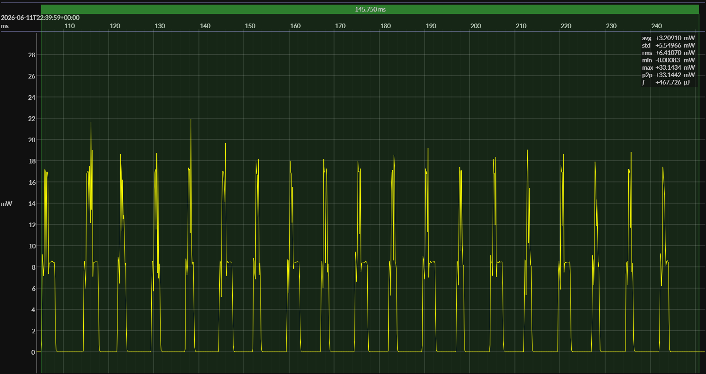
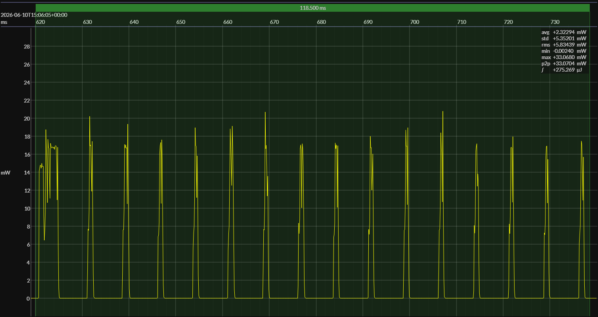

# TI CC2340R5 SimpleLink, Zephyr, and EM•Script Results

**Status:** TI results milestone  
**Repository:** `bluejoule-gatt`  
**Benchmark definition:** [`01-bluejoule-gatt-definition.md`](01-bluejoule-gatt-definition.md)  
**Measurement workflow:** [`04-emscope-measurement-workflow.md`](04-emscope-measurement-workflow.md)  
**Nordic comparison:** [`05-nrf52-results-and-cross-generation-comparison.md`](05-nrf52-results-and-cross-generation-comparison.md)  
**Tooling:** EM•Scope v25.6.x

## TLDR

- BlueJoule-GATT now has three working TI CC2340R5 implementations.
- SimpleLink BLE5 is TI’s mature incumbent BLE stack.
- Zephyr is TI’s newer portable BLE path.
- EM•Script is the profile-specialized tiny-code implementation.
- All three implementations are functional and scoreable.
- All three were measured at 3.0 V using EM•Scope event-based scoring.
- The TI SimpleLink BLE5 result scores 10.95 EM•eralds.
- The TI Zephyr result scores 19.49 EM•eralds.
- The TI EM•Script result scores 33.19 EM•eralds.
- EM•Script has the lowest TI event energy measured so far.
- EM•Script has the highest TI 10 s EM•erald score measured so far.
- SimpleLink shows an unexpectedly high active floor during the connection.
- Zephyr drops much lower between connection intervals than SimpleLink.
- The TI EM•Script result extends the tiny-code comparison beyond Nordic hardware.

## 1. Purpose

This report extends BlueJoule-GATT beyond Nordic hardware to the TI CC2340R5.

Earlier reports compared Zephyr and EM•Script on Nordic nRF52 and nRF54. This report adds three TI CC2340R5 implementations: TI SimpleLink BLE5, TI Zephyr, and EM•Script.

The goal is to compare these three TI implementations using the same BlueJoule-GATT transaction and the same EM•Scope event-based scoring method.

This is not intended as a final TI optimization study. It is a first same-device TI comparison across the mature TI BLE stack, TI’s Zephyr path, and the EM•Script tiny-code implementation.

## 2. Measurement Set

This report compares three TI CC2340R5 BlueJoule-GATT implementations:

    Implementation       Role

    SimpleLink BLE5      TI mature BLE reference stack
    Zephyr               TI portable Zephyr BLE path
    EM•Script            profile-specialized tiny-code implementation

All three implementations support the same benchmark behavior:

    advertise BlueJoule-GATT
    accept connection from the benchmark central
    support targeted service discovery
    support targeted characteristic discovery
    accept Command write
    return Status read
    disconnect
    repeat

All measurements were taken at 3.0 V and scored using the EM•Scope event-based what-if path.

The primary comparison point is the 10 s EM•erald score.

## 3. TI SimpleLink BLE5 Baseline

The SimpleLink BLE5 implementation represents TI’s mature, long-supported BLE stack.

The BlueJoule-GATT profile was implemented locally using two new profile files:

    bj_gatt_profile.c
    bj_gatt_profile.h

The implementation exposes the required benchmark UUIDs:

    Service:  0000B100-0000-1000-8000-00805F9B34FB
    Status:   0000B101-0000-1000-8000-00805F9B34FB
    Command:  0000B102-0000-1000-8000-00805F9B34FB

The benchmark behavior is:

    Command write = X
    Status read   = X | 0x80

The SimpleLink peripheral is functional and scoreable:

    advertises as BlueJoule-GATT
    exposes B100/B101/B102
    accepts the benchmark central
    supports targeted discovery
    accepts Command writes
    returns Status reads
    disconnects and restarts

The measured sleep current is excellent, around 0.2 µA. However, the connection transaction energy is high. The current trace shows that SimpleLink remains at a relatively high active floor between connection intervals, rather than dropping close to zero between events.

Current 3.0 V result:

    sleep current:       ~0.2 µA
    event energy:        ~839.6 µJ
    10 s score:          10.95 EM•eralds

## 4. TI Zephyr Baseline

The Zephyr implementation represents TI’s newer portable BLE path.

The existing BlueJoule-GATT Zephyr peripheral was built and run on LP-EM-CC2340R5 using TI’s downstream Zephyr 3.7-based support. The application-level benchmark behavior remained portable.

The Zephyr peripheral is functional and scoreable:

    advertises BlueJoule-GATT
    accepts the benchmark central
    supports targeted discovery
    accepts Command writes
    returns Status reads
    disconnects and restarts

Packet capture showed the expected BlueJoule-GATT transaction shape. It also showed one TI Zephyr-specific LL control exchange not seen in the Nordic Zephyr or TI SimpleLink captures:

    LL_LENGTH_REQ
    LL_UNKNOWN_RSP

In this trace, the TI Zephyr peripheral initiated the length request and the benchmark central responded with `LL_UNKNOWN_RSP`. This appears to be an implementation-specific Zephyr-on-TI behavior. It adds some protocol overhead, but it is not part of the BlueJoule-GATT benchmark transaction itself.

The TI Zephyr transaction took 19 connection intervals, compared with about 17 intervals for the Nordic Zephyr baseline. The extra control exchange may explain part of the higher interval count.

Current 3.0 V result:

    sleep current:       0.2 µA
    event energy:        468.4 µJ
    10 s score:          19.49 EM•eralds

## 5. TI EM•Script Result

The EM•Script implementation represents the profile-specialized tiny-code path.

Unlike the SimpleLink and Zephyr implementations, the EM•Script implementation is not using a general-purpose BLE stack. It implements the BlueJoule-GATT peripheral behavior directly, with the benchmark profile and packet flow known at build time.

The EM•Script peripheral is functional and scoreable:

    advertises BlueJoule-GATT
    accepts the benchmark central
    supports targeted discovery
    accepts Command writes
    returns Status reads
    disconnects and restarts

The TI EM•Script implementation has the lowest measured event energy of the three TI implementations.

It also reaches the same 0.2 µA sleep-current level as the SimpleLink and Zephyr measurements.

Current 3.0 V result:

    sleep current:       0.2 µA
    event energy:        274.3 µJ
    10 s score:          33.19 EM•eralds

## 6. Measurement Artifacts

Each TI measurement is represented by an EM•Scope-generated `ABOUT.md` report and representative event image.

Primary measurement artifacts:

- [TI SimpleLink BLE5](../assets/captures/ti-23-lp/simplelink-3V0-P/ABOUT.md)
- [TI Zephyr](../assets/captures/ti-23-lp/zephyr-3V0-P/ABOUT.md)
- [TI EM•Script](../assets/captures/ti-23-lp/emscript-3V0-P/ABOUT.md)

These reports provide the source data for the score matrix below, including sleep power, event energy, 10 s energy per period, EM•erald score, and representative event waveform.

## 7. Score Matrix

All three TI CC2340R5 implementations were measured at 3.0 V and scored using the EM•Scope event-based what-if path.

| Implementation | Sleep Power | Event Energy | 10 s Energy / Period | Energy / Day | 10 s Score |
|---|---:|---:|---:|---:|---:|
| SimpleLink BLE5 | 614.6 nW | 966.6 µJ | 972.8 µJ | 8.4 J | 9.52 EM•eralds |
| Zephyr | 672.5 nW | 633.6 µJ | 640.4 µJ | 5.5 J | 14.46 EM•eralds |
| EM•Script | 465.5 nW | 550.8 µJ | 555.4 µJ | 4.8 J | 16.67 EM•eralds |

The sleep power is low in all three cases. The main difference is the energy of the connection transaction itself.

EM•Script has the lowest measured event energy and the highest 10 s EM•erald score among the three TI CC2340R5 implementations.

Compared with the two TI general-purpose stack implementations:

    EM•Script uses about 43% less event energy than SimpleLink BLE5.
    EM•Script uses about 13% less event energy than Zephyr.
    EM•Script scores about 75% higher than SimpleLink BLE5.
    EM•Script scores about 15% higher than Zephyr.

## 8. Program Size

Program size is a second major differentiator.

Current TI CC2340R5 build sizes:

| Implementation  | Read-only Memory | Read-write Memory |
| --------------- | ---------------: | ----------------: |
| SimpleLink BLE5 |        170,309 B |          28,711 B |
| Zephyr          |        163,000 B |          30,468 B |
| EM•Script       |         17,352 B |             308 B |

For SimpleLink BLE5, read-only memory is `.text + .rodata`; read-write memory is `.data + .bss`.

For Zephyr, read-only memory is the reported flash size and read-write memory is the reported RAM size.

For EM•Script, read-only memory is `text + const`; read-write memory is `data + bss`.

The EM•Script build remains much smaller than either general-purpose stack implementation:

```
text  =  8,124 B
const =  9,228 B
data  =     88 B
bss   =    220 B
```

Most of the EM•Script `const` footprint is TI radio support data. About 8 KB of the 9,228 B `const` total is made up of three TI radio firmware patch images that must be carried in read-only memory and loaded into the radio subsystem at runtime.

That fixed radio-support cost is not BlueJoule-GATT application logic, and it is not EM•Script protocol logic. Even including it, the EM•Script image remains much smaller than either SimpleLink BLE5 or Zephyr.

This is an important part of the result. EM•Script has the highest TI score in this benchmark while using far less memory than either general-purpose stack implementation.

Smaller code is also likely to reduce instruction-fetch pressure. This report does not include CC2340R5 cache statistics, but [Report 06](06-cache-statistics-and-instruction-fetch-pressure.md) showed that the smaller EM•Script implementation produced much less cache activity and far fewer cache misses than Zephyr during the same BlueJoule-GATT transaction on Nordic hardware.

## 9. Interpretation

The three TI CC2340R5 results show a clear ranking for this benchmark:

```
SimpleLink BLE5:  9.52 EM•eralds
Zephyr:          14.46 EM•eralds
EM•Script:       16.67 EM•eralds
```

The representative event traces show why the scores differ. All three implementations complete the same BlueJoule-GATT transaction, but the current profile during the transaction is very different.

**SimpleLink BLE5**


**Zephyr**



**EM•Script**



Several differences are visible directly in the traces.

SimpleLink BLE5 shows a much higher active floor during the connection. It reaches low sleep current outside the transaction, but it does not drop as deeply between connection intervals while the connection is active.

Zephyr drops much lower between connection intervals, but the individual connection intervals are visibly wider and more expensive than the corresponding EM•Script intervals.

EM•Script also drops low between intervals, while spending less time active inside the intervals. This is consistent with the lower measured event energy.

All three implementations reach the same low sleep-current class outside the transaction. The score differences are therefore driven primarily by connection-transaction energy rather than by long-term sleep power.

SimpleLink BLE5 has excellent sleep behavior, but its connection event is much more expensive. The current trace shows a high active floor during the connection, especially between connection intervals.

Zephyr improves substantially on the SimpleLink result. It drops much lower between connection intervals and has a lower event-energy impulse, although the measured transaction still includes some TI Zephyr-specific protocol overhead.

EM•Script has the lowest event energy and the highest score of the three TI implementations. The result is not as large a separation as the Nordic nRF54 result, but it is still directionally consistent: the smaller, profile-specialized implementation uses less energy for the same BlueJoule-GATT transaction.

The most important point is that this is now a same-device comparison. All three measurements are on TI CC2340R5, using the same benchmark behavior and the same EM•Scope event-based scoring path.

## 10. Current Caveats

These TI results should be treated as current engineering measurements, not as a final TI optimization study.

The SimpleLink BLE5 result is functional and repeatable, but the high active floor during the connection has not yet been fully explained. The application was reduced to the benchmark behavior, TX power was checked, and sleep current outside the transaction is excellent. The remaining energy difference appears to be in the connection-active behavior.

The Zephyr result uses TI’s downstream Zephyr support for CC2340R5. The application-level BlueJoule-GATT behavior is portable, but the exact controller and link-layer behavior should not be assumed to represent all future Zephyr-on-TI configurations.

The TI Zephyr trace includes an implementation-specific LL control exchange:

```
LL_LENGTH_REQ
LL_UNKNOWN_RSP
```

This exchange was not seen in the Nordic Zephyr or TI SimpleLink measurements. It adds protocol activity to the measured transaction and may be configurable, version-specific, or specific to the current TI Zephyr stack.

The EM•Script result uses the TI CC2340R5 radio support required for this implementation path, including the TI radio firmware patch images discussed in the program-size section. Those patch images are a fixed read-only-memory cost of using the CC2340R5 radio subsystem.

The EM•Script result also uses the TI CC2340R5 generic packet engine rather than TI’s BLE-specific packet-engine operation. Earlier bring-up attempted to use the BLE-specific advertiser path, but the implementation was completed using the generic transmit/receive packet engine instead.

That means the EM•Script implementation performs some BLE link-layer timing and protocol sequencing in application code that might otherwise have been assisted by a BLE-specific radio firmware path. In particular, the implementation manages the BLE packet flow, inter-frame timing, and connection-state progression directly above a more generic radio packet engine.

This is a caveat, but it also makes the result more notable: even without using the BLE-specific packet-engine operation, the EM•Script implementation still has the lowest measured TI event energy and the highest TI BlueJoule-GATT score in this report.

All scores in this report use the EM•Scope event-based scoring path. In particular, the reported scores are based on the representative connection event and exclude pre-connection advertising energy from the benchmark transaction.

## 11. Closing Note

The TI CC2340R5 results extend BlueJoule-GATT from a Nordic-only comparison to a multi-vendor benchmark.

On TI hardware, all three implementations are functional and scoreable:

```
SimpleLink BLE5
Zephyr
EM•Script
```

The results show that the profile-specialized EM•Script implementation currently has the lowest measured event energy, the highest 10 s EM•erald score, and by far the smallest memory footprint among the TI CC2340R5 implementations measured so far.

The TI result is especially useful because it is a same-device comparison. It separates implementation effects from silicon effects and shows that the tiny-code approach can remain competitive even when the radio subsystem and packet-engine model are very different from Nordic.

Together with the earlier Nordic nRF52 and nRF54 results, this establishes BlueJoule-GATT as a practical benchmark for comparing BLE connection energy across both implementations and MCU families.

<p align="right">
  <sub>
    drafted with ChatGPT &ndash; reviewed/approved by
    <a href="https://github.com/biosbob">@biosbob</a>
  </sub>
</p>
