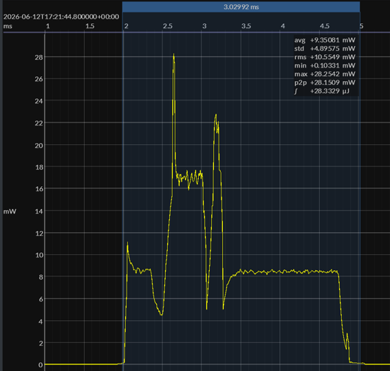
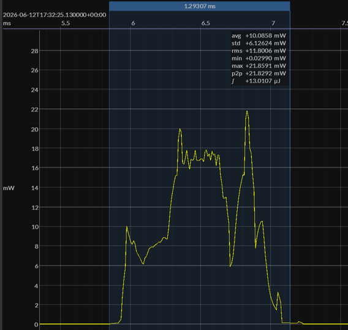
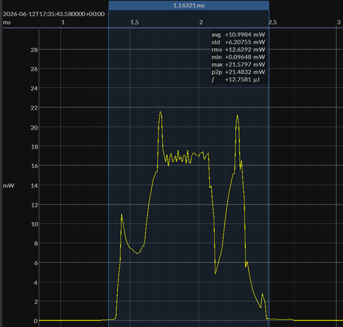

# TI CC2340R5 Connection-Event Drilldown

**Status:** Event-drilldown milestone<br>
**Repository:** `bluejoule-gatt`<br>
**Benchmark definition:** [`01-bluejoule-gatt-definition.md`](01-bluejoule-gatt-definition.md)<br>
**EM•Script candidate precedent:** [`03-emscript-candidate-implementation.md`](03-emscript-candidate-implementation.md)<br>
**Measurement workflow:** [`04-emscope-measurement-workflow.md`](04-emscope-measurement-workflow.md)<br>
**TI same-device results:** [`07-ti-cc2340r5-results.md`](07-ti-cc2340r5-results.md)<br>
**Tooling:** EM•Scope v25.6.x, Joulescope<br>

## TLDR

* Report 7 compared complete BlueJoule-GATT connection transactions on TI CC2340R5.
* This report drills into one matched connection event inside those transactions.
* The selected event contains the central ATT Read Request for the final Status read.
* The primary comparison is TI Zephyr versus TI EM•Script flash/cache execution.
* Both captures use the same TI CC2340R5 hardware, 3.0 V supply, radio, benchmark operation, and BLE timing model.
* For this matched event, Zephyr takes about 3.03 ms and 28.3 µJ.
* EM•Script takes about 1.29 ms and 13.0 µJ.
* The radio exchange itself is not the main differentiator.
* The visible difference is the post-exchange software tail: processing the received ATT request and preparing the next outbound response.
* An EM•Script SRAM build is included as a secondary execution-locality note.

## 1. Purpose

Report 7 established the TI CC2340R5 same-device BlueJoule-GATT scores:

```
SimpleLink:  10.95 EM•eralds
Zephyr:      19.49 EM•eralds
EM•Script:   33.19 EM•eralds
```

Those whole-transaction scores remain the primary benchmark result.

This report zooms in on one matched connection event inside the Zephyr and EM•Script captures. The goal is to expose the event-local software cost that is partly hidden inside the full transaction score.

This mirrors the earlier Nordic event-level comparison in Report 3, but now on TI hardware. The emphasis here is narrower: same device, same radio, same benchmark event, different software path.

SimpleLink was also inspected and is discussed in Report 7. For this drilldown, the main comparison is Zephyr versus EM•Script, which is the cleanest software-path comparison and matches the earlier Nordic Zephyr/EM•Script structure.

## 2. Selected Event

The selected event is the connection interval containing the central ATT Read Request for the final Status read.

This event was chosen because it exercises the benchmark-relevant ATT/GATT read path while keeping the over-the-air exchange very small.

In this interval:

```
RX from central:      ATT Read Request
TX from peripheral:  empty data PDU / ACK
```

The actual ATT Read Response is transmitted in the following connection interval, after the request has been processed and the response packet has been prepared.

The ATT Read Request payload has the form:

```
0A <handle-lo> <handle-hi>
```

where `0A` is the ATT Read Request opcode and the two handle bytes identify the Status characteristic value handle.

This is intentionally simple. At the application level, the requested value is just a small status value read from memory. The interesting measurement is therefore not the amount of data on the air. It is the software required to decode the request, resolve the handle, obtain the value, prepare the next response, and return toward idle.

The selected event should not be read as requiring the ATT Read Request to be decoded and answered inside the 150 µs T_IFS window. The packet transmitted in the current interval was already prepared. The newly received request is processed after the current radio exchange, preparing the response for the following interval.

## 3. Primary Event Comparison: Zephyr vs EM•Script

**Zephyr**



**EM•Script**



Measured event summary:

| Implementation | Duration | Event Energy |
| -------------- | -------: | -----------: |
| Zephyr         |  3.03 ms |      28.3 µJ |
| EM•Script      |  1.29 ms |      13.0 µJ |

For this matched event, EM•Script completes the event in less than half the time and uses less than half the energy of Zephyr.

The reduction is not explained by a different radio or a different packet exchange. The radio peaks are broadly similar because the same hardware is sending and receiving the same benchmark traffic.

The difference is the software tail after the exchange. The current packet exchange has completed; the received ATT Read Request must now be decoded, the Status handle resolved, the next response prepared, and the system returned toward idle.

Zephyr and EM•Script follow the same basic event model: exchange the current packet, then process the newly received packet and prepare the next outbound packet. The visible difference is how much software has to run after the exchange.

In this case, the operation is intentionally simple: a GATT read of a small status value. Even so, the Zephyr trace shows a much longer software tail, while EM•Script completes the same event-local work much sooner.

Finishing sooner matters. Every shortened software tail leaves more time before the next connection interval for low-power idle.

This is the main result of the drilldown: on the same TI radio hardware, for the same benchmark event, EM•Script reduces the software-controlled active window.

## 4. SRAM Execution Side Note

The primary comparison in this report uses the normal EM•Script flash/cache build. That keeps the Zephyr versus EM•Script comparison aligned with Report 7.

A second EM•Script build was also measured with the hot runtime executing from SRAM.

**EM•Script SRAM**



Measured EM•Script event summary:

| EM•Script Build | Duration | Event Energy |
| --------------- | -------: | -----------: |
| Flash/cache     |  1.29 ms |      13.0 µJ |
| SRAM            |  1.16 ms |      12.8 µJ |

The SRAM build shortens the matched event. The energy improvement is smaller than the time improvement because this event still includes fixed radio and radio-support energy. Even so, the SRAM trace shows the expected direction: once the software-controlled tail has been isolated, improving software execution can be seen directly.

This is a secondary result, not the main benchmark comparison. The main result remains that EM•Script flash/cache already completes the matched event in less than half the time and less than half the energy of Zephyr.

The SRAM result is still important because it shows another consequence of tiny code.

Earlier cache-statistics work showed that reducing code size does more than reduce the number of instructions needed to complete the same work. It also reduces instruction-fetch pressure and cache-miss activity. See [Report 06](06-cache-statistics-and-instruction-fetch-pressure.md).

On the TI CC2340R5, the same principle can be taken further. Because the EM•Script hot path is small, it can be placed in SRAM. In that configuration, the active code path can execute without flash wait states, without instruction-cache misses, and with less need to keep the flash/cache path active during the event.

This is especially natural on the CC2340R5. The device uses a simpler Cortex-M0+ execution architecture, where instruction and data accesses already share the same basic memory path. Moving the hot instruction stream into zero-wait-state SRAM can therefore behave much like a perfect instruction cache for this small hot path.

That is not automatically true on every MCU. More advanced cores and memory systems may already separate instruction and data traffic, and moving code into SRAM can introduce different contention or retention tradeoffs. On some devices, cache execution may already be better than SRAM execution.

The CC2340R5 also has very low SRAM retention cost. In this measurement setup, retaining the SRAM needed for the hot code does not impose the same kind of sleep-current penalty that it might on platforms where retained SRAM must be minimized more aggressively.

This is where EM•Script’s small code size matters twice. First, the profile-specialized software path does less work. Second, the remaining hot path is small enough to move into SRAM on a device where SRAM execution and SRAM retention are both favorable.

For BlueJoule-GATT, the whole-transaction benefit is modest because radio activity, radio wait time, and connection timing still dominate much of the energy. For more CPU-heavy workloads, the same SRAM/locality effect should become more important.

## 5. Interpretation

The matched event drilldown isolates a software-controlled part of the BlueJoule-GATT transaction.

At full transaction scale, the score includes repeated connection intervals, sleep behavior, radio scheduling, packet traffic, and implementation behavior. At matched-event scale, the comparison is narrower.

For the selected ATT Read Request event, the over-the-air exchange is small and broadly fixed. The main difference is how long each implementation stays active after the exchange while processing the received request and preparing the next response.

That difference is large:

```
Zephyr:     3.03 ms, 28.3 µJ
EM•Script:  1.29 ms, 13.0 µJ
```

This supports the central BlueJoule-GATT software thesis: for a bounded BLE profile transaction, a profile-specialized implementation can avoid much of the general-purpose stack machinery that runs inside each connection event.

The result is also consistent with the earlier Nordic event-level comparison in Report 3. In both cases, the event drilldown shows that EM•Script is not only smaller in program memory, but also shorter and lower-energy in the event-local software path.

The SRAM side note extends the same theme. Once the hot software path is small, it can sometimes be moved into a more favorable execution memory. On CC2340R5, that further shortens the selected event, although the total energy remains partly dominated by radio and radio-support activity.

The main conclusion is therefore not just that EM•Script wins the whole-transaction score. The event drilldown shows where part of that advantage comes from: less software work, completed sooner, on the same radio hardware.

## 6. Caveats

This report is an event-level drilldown, not a replacement for the whole-transaction BlueJoule-GATT score.

The selected event was chosen manually from existing captures. It was selected to represent the same semantic point in the benchmark transaction: the connection interval containing the central ATT Read Request for the final Status read.

The event images should be interpreted as matched engineering views, not as a formal protocol timing proof. They are most useful for comparing the shape, duration, and integrated energy of the same benchmark-relevant event across implementations.

The selected read operation is intentionally simple. The requested Status value is small, and the over-the-air packet exchange is small. That is part of why the result is interesting: even for a minimal GATT read, the general-purpose stack path has visible software overhead.

The SRAM result is included as a side note only. The primary comparison remains Zephyr versus EM•Script flash/cache execution, matching the execution mode used in Report 7.

Finally, the SRAM result should not be generalized to every MCU. CC2340R5 is a favorable case because the hot EM•Script path is small, SRAM retention cost is low, and SRAM execution is well matched to this Cortex-M0+ based memory architecture.

## 7. Closing Note

This report adds a finer-grained view of the TI CC2340R5 BlueJoule-GATT result.

Report 7 showed the whole-transaction score. This drilldown shows one reason behind that score: for the same matched ATT Read Request event, EM•Script spends much less time and energy in the software-controlled part of the connection interval than Zephyr.

That distinction matters because the hardware and radio exchange are held constant. The selected event uses the same TI CC2340R5 radio, the same benchmark operation, and the same BLE timing model. What changes is the software path.

The result supports the broader BlueJoule-GATT thesis: for a bounded BLE profile, profile-specialized tiny code can reduce active time, reduce event energy, and return the system toward idle sooner.

The SRAM side note points to a further opportunity. Once the hot software path is small enough, execution locality becomes another lever. On CC2340R5, that lever is visible even in a radio-dominated benchmark event and should become more important in workloads with more CPU-side computation.

<p align="right">
  <sub>
    drafted with ChatGPT &ndash; reviewed/approved by
    <a href="https://github.com/biosbob">@biosbob</a>
  </sub>
</p>
